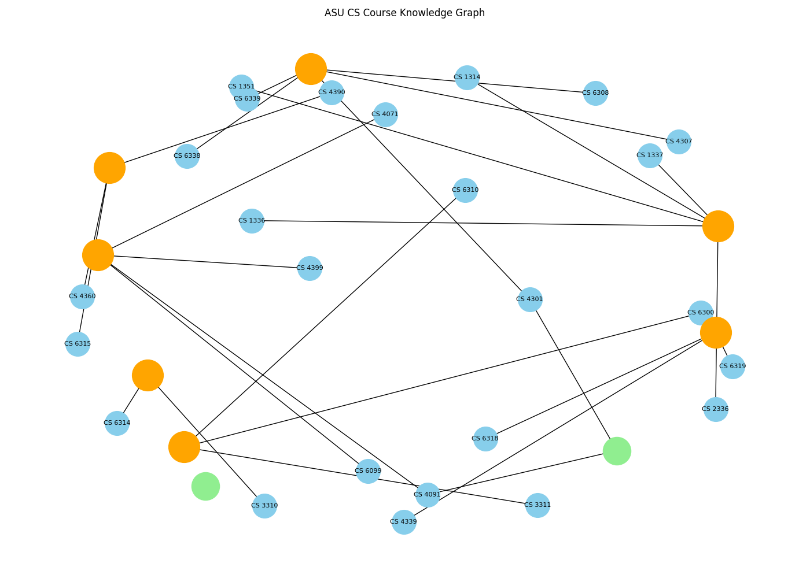

# intelligent-knowledge-system
# ASU CS Course Knowledge Graph

A multi-relational knowledge graph built from real Angelo State University (ASU) course data.  
The system supports interactive querying, filtering, and recommendation of courses based on category and delivery format.

---

## 🚀 Features

- Data pipeline: raw → cleaned → structured JSON
- Knowledge graph using NetworkX
- Multi-relational modeling:
  - Course → Category (AI/ML, Cybersecurity, etc.)
  - Course → Format (Online / Face to Face)
- Interactive CLI query system
- Recommendation engine (graph-based reasoning)
- Graph visualization (PNG export)

---

## 🧠 Tech Stack

- Python
- NetworkX
- Matplotlib
- JSON data pipeline

---

## 📊 Example Visualization



---

## ⚙️ Setup

```bash
pip install -r requirements.txt

🔍 Available Commands
1. List all courses
list
2. Search courses by keyword
search machine
search security
search data
3. Filter by format
format Online Course
format Face to Face
4. Filter by category
category AI/ML
category Cybersecurity
category Data/Database
category Systems
category Programming/Foundation
5. View course details
details CS 3311
6. Graph summary
summary
7. Help menu
help
8. Exit program
exit
💡 Example Usage
query> search machine
query> category AI/ML
query> details CS 3311
🗂 Output

Each query result is automatically saved to:

data/output/query_results.json
🧩 Project Structure
data/
├── raw/          # original ASU data
├── processed/    # cleaned course dataset
└── output/       # query results and graph images

## 🧠 Interactive Query Usage

After running the query system, you can interact with the knowledge graph using the following commands:

### ▶️ Run the tool

```bash
python query_graph.py